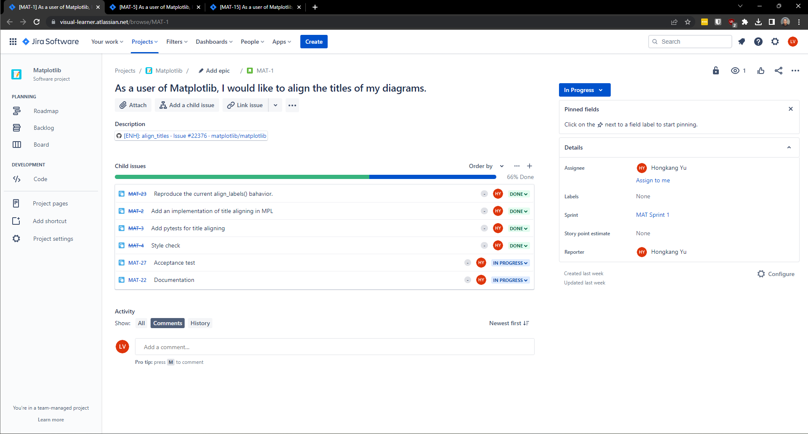
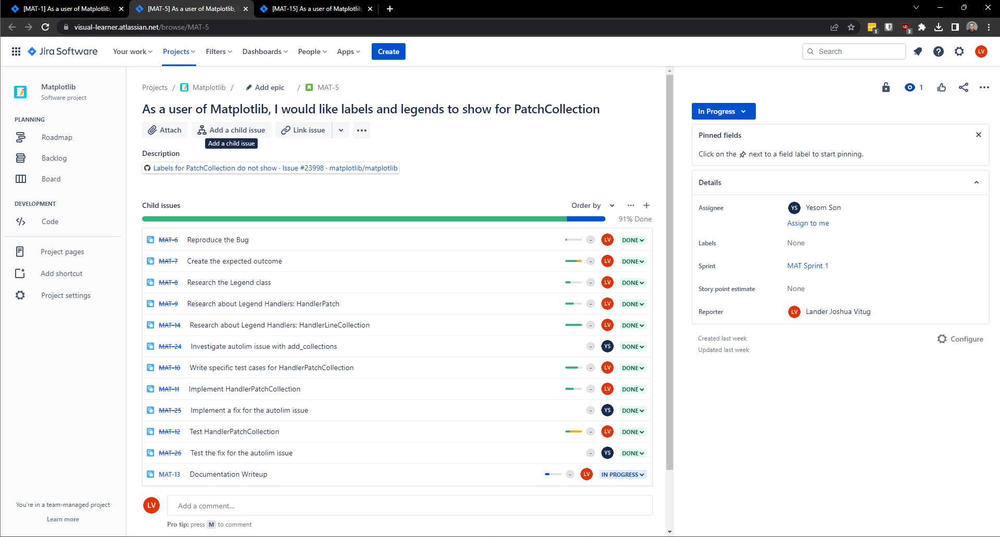
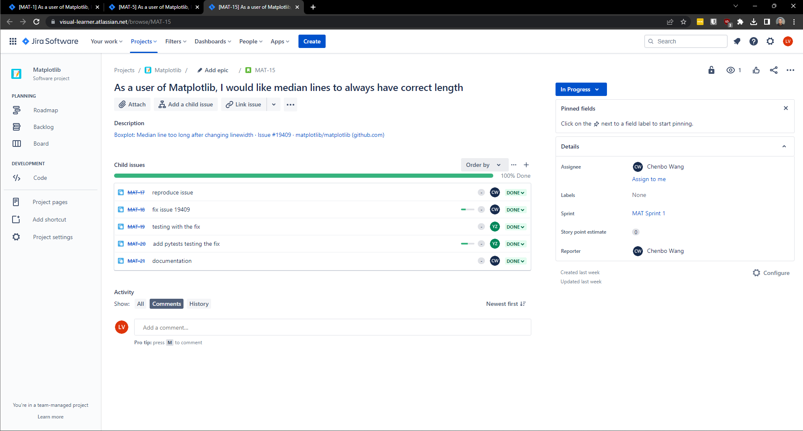
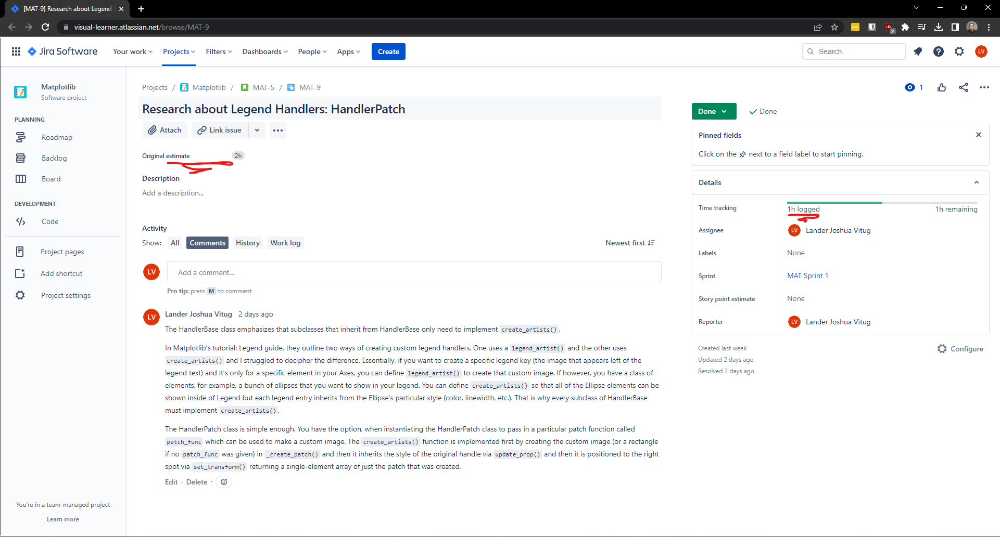

# Development Process

## Table of Contents:
* Project Management Process
* Communication Process
* Github Process

## Project Management Process
In order to see everyone's progress we use Jira. For deliverable 3, we are required to fix/address three different issues. Therefore we created three user stories which corresponded to each issue.

Everyone went through Matplotlib's Issues tab scouring for a good "good first issue" / "difficulty: easy" issue. Once everyone has what they want to do in mind, Hongkang Yu volunteered to work on his own since we were a group of five having to split between three issues. The four of us were then randomly assigned into groups of two. From there, it was a discussion amongst each other for what issue each group will ultimately decide to do. After reading more about the issue, each group listed out subtasks to further divide the work and added their estimations on Jira. The following three screenshots show each issue's subtasks:

#### Issue #22376 (Hongkang Yu)

#### Issue #23998 (Yesom Son & Lander Joshua Vitug)

#### Issue #19409 (Chenbo Wang & Yuehai Zhou)

Throughout the development process, we each tracked our tasks by updating the hours we spent for each subtask and adding comments whenever necessary. Here's an example highlighting task tracking and estimating:

## Communication Process
To ensure that we have consistent significant updates, we decided early on to schedule meetings every two days as a general standup meeting. This is because as students, we may not have time everyday to work on our issues. In addition, we also had meeting minutes to keep track of basic information such as the start and end times of our meetings, but also Action Items for both past and future meetings. This allows us to hold each other accountable and set realistic goals for the next two days. All of our meeting minutes have been uploaded into Github under `deliverable3/Meeting_Minutes`. 

This is not to say that we don't communicate as a group still. We still message and video call whenever necessary to get the work done, but this is more sporatic campared to the consistent meetings we have every two days.

## Github Process
During our first meeting in March 4, 2023, we agreed on employing git flow which organizes our Github repository into two main branches: `main` and `development`. Everyone will branch from `development` in order to implement their issues before merging back to the `development` branch. At the end of each deliverable we then merge `development` into `main`. And as we agreed in the `Team Agreement` pdf back in deliverable 1, every pull request must be approved by at least two other team members. 
