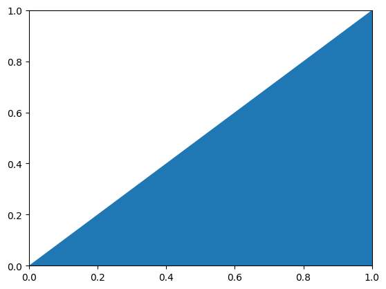

# [Issue #23998 - PatchCollection Labels and Autoscale](https://github.com/matplotlib/matplotlib/issues/23998) 
Lander Joshua Vitug (Part 1) | Yesom Son (Part 2) 
<br /><br />

# **Brief Description of the Issue**

There are two issues that the original poster of this issue highlights:

* **Part 1:** A legend of the Figure/Axes does not display PatchCollection elements.

* **Part 2:** Autoscaling patch collections does not work with legend.

<br />

# **Part 1**

## **Implementation**

A PatchCollection is a container that allows users to group patch elements together. Legends are used as a reference to understand and identify what each element of a plot is supposed to be. Therefore, the question arises: why does legend not support PatchCollection? `Legend` already supports other collections from `PathCollection` to `PolygonCollection`, so `PatchCollection` will fit right in.

To allow the `Legend` class to support `PatchCollection` objects, we need to do the following:
-   Create a new subclass that inherits from `HandlerBase` (or subclasses that eventually inherit HandlerBase) - let's call it `HandlerPatchCollection` ([code snippet](https://github.com/sonnmi/d01w23-team-Visual-Learners/blob/4f76ce84b030509cf5b255dea19c4a8b69ce1320/matplotlib-main/lib/matplotlib/legend_handler.py#L819))
```python
# matplotlib-main/lib/matplotlib/legend_handler.py line 819
class HandlerPatchCollection(HandlerPatch):
	...
```
-   Override `HandlerBase`’s `create_artists()` function, adding other functions that may be necessary - taking inspiration from `HandlerPatch`, `HandlerPolyCollection`, and `HandlerLineCollection` ([code snippet1](https://github.com/sonnmi/d01w23-team-Visual-Learners/blob/4f76ce84b030509cf5b255dea19c4a8b69ce1320/matplotlib-main/lib/matplotlib/legend_handler.py#L823) [code snippet2](https://github.com/sonnmi/d01w23-team-Visual-Learners/blob/4f76ce84b030509cf5b255dea19c4a8b69ce1320/matplotlib-main/lib/matplotlib/legend_handler.py#L857))
```python
# matplotlib-main/lib/matplotlib/legend_handler.py line 823
def _default_update_prop(self, legend_handle, orig_handle):
	...

def create_artists(self, legend, orig_handle, 
				   xdescent, ydescent, width, height, fontsize, trans):
	...
```
-   Update the `_default_handler_map` in `Legend` class to include this new subclass - in our case, mapping `PatchCollection` to `HandlerPatchCollection` ([code snippet](https://github.com/sonnmi/d01w23-team-Visual-Learners/blob/4f76ce84b030509cf5b255dea19c4a8b69ce1320/matplotlib-main/lib/matplotlib/legend.py#L742))
```python
# matplotlib-main/lib/matplotlib/legend.py line 742
_default_handler_map = {
	...
	PatchCollection: legend_handler.HandlerPatchCollection()
}
```

Now, when a legend needs to be displayed, as it iterates through the list of elements in a `Figure` or `Axes` and a `PatchCollection` object appears, the legend will refer to its `_default_handler_map` and see that `HandlerPatchCollection` will handle displaying this type of object. Therefore, a legend entry for `PatchCollection` appears in the legend along with other elements.

-   lib/matplotlib/legend.py - to update \_default_handler_map
-   lib/matplotlib/legend_handler.py - to add the HandlerPatchCollection subclass
-   lib/matplotlib/tests/test_legend.py - to add unit and acceptance tests for HandlerPatchCollection ([starts at line 1267](https://github.com/sonnmi/d01w23-team-Visual-Learners/blob/4f76ce84b030509cf5b255dea19c4a8b69ce1320/matplotlib-main/lib/matplotlib/tests/test_legend.py#L1267) first four are acceptance, next five are unit tests)

Because this issue was straightforward, the design of Matplotlib was unchanged. 

<br />

## **Testing**

#### **Unit tests**
Unit tests can be found in ['']()

<br />

#### **Acceptance Tests**:
*Scenario 1: User wants to create a PatchCollection of one Patch and display the legend*
1.  A user creates a `Patch` object
2.  A user creates a `PatchCollection` object using the `Patch` object and add a label to it
3.  A user calls the function `legend()` either from figure or axes
4.  A user displays the figure

<br>

*Scenario 2: User wants to create a PatchCollection of multiple Patches and display the legend*
1.  A user creates a `Patch` object
2.  A user creates a `PatchCollection` object using the list of `Patch` objects and add a label to it
3.  A user calls the function `legend()` either from figure or axes
4.  A user displays the figure

<br>

*Scenario 3: User wants to create a PatchCollection of multiple Patches and have a custom legend marker to be displayed*
1.  A user creates a custom function with the following parameters:  legend, orig_handle, xdescent, ydescent, width, height, fontsize and ensure that it returns a `Patch` object
2.  A user creates a list of `Patch` objects
3.  A user creates a `PatchCollection` object using the list of `Patch` objects and add a label to it
4.  A user calls the function `legend()` either from figure or axes assigning the handler_map parameter to a map of PatchCollection objects to an instance of `HandlerPatchCollection` with the custom function passed into it
5.  A user displays the figure

<br /><br />

# **Part 2**

## **Implementation**

The issue was that a user should manually set the limits even though a user adds a poly-collection with `autolim` True, which should autoscale.

*Observation:* Autoscaling works properly with `plot()` but not with `legend()`.
```python
# an example code in the issue #23998
import matplotlib.pyplot as plt
from matplotlib.collections import PatchCollection
from matplotlib.patches import Polygon

fig, axs = plt.subplots()
p1, p2 = Polygon([[0,0],[100,100],[200,0]], label="p1"), Polygon([[400,0],[500,100],[600,0]], label="p2")
p = PatchCollection([p1,p2], label="asd")
axs.add_collection(p, autolim=True)

axs.legend() # does not autoscale
# but axs.plot() autoscales properly.
```
The outputs are as follows:

`axs.plot()` output:


`axs.legend()` output:



This observation implies that `legend()` needs to be fixed to allow users to autoscale without making them manually set limits `xlim` and `ylim`; scaling should be done behind the scene so that users do not have to worry about autoscaling.

<br />

I changed one file '_axes.py'. Here is the code snippet in ['lib/matplotlib/axes lines 321-332'](https://github.com/sonnmi/d01w23-team-Visual-Learners/blob/4f76ce84b030509cf5b255dea19c4a8b69ce1320/matplotlib-main/lib/matplotlib/axes/_axes.py#L321-L332.) I could fix the autoscaling issue by sorely changing a function `legend()`. Here is the code snippet.
```python
def legend(self, *args, **kwargs):
	...
	for collection in self.collections:
		datalim = collection.get_datalim(self.transData)
		x = self.get_xlim()
		x0 = min(x[0], datalim.x0)
		x1 = max(x[1], datalim.x1)
		if x0 < x1:
			self.set_xlim(left=x0, right=x1)
		y = self.get_ylim()
		y0 = min(y[0], datalim.y0)
		y1 = max(y[1], datalim.y1)
		if y0 < y1:
			self.set_ylim(bottom=y0, top=y1)
	...
```
To update the `xlim` and `ylim` and scale the entire figure, the code iterates through the `PatchCollection` objects added to the axes and finds the minimum and maximum limits of the scales. Since an `Axes` object has a `collections` attribute, I could traverse the collections and check the x and y limits of each without having to add any dependency or inheritance. It conforms to SOLID design principles since no modification related to dependency or inheritance issues was made.

One concern might be that `collections` are a method that returns an `ArtistList` object given the `Axes` object. This dependency, however, is unavoidable as it is how Matplotlib is implemented. However, by conforming to SOLID design principles, it will not cause issues from the implementation as it is open for extension and closed for modification according to *Open-Closed Principle*; it should add new functionality without modifying the existing code.

Because the codes add autoscaling functionality, which is still relevant to placing legend, without changing the existing code and there was no change in inheritance, it obeys all SOLID design principles.

<br />

## **Testing**

#### **Unit tests**
Unit tests can be found in ['lib/matplotlib/tests/test_legend.py'](https://github.com/sonnmi/d01w23-team-Visual-Learners/blob/4f76ce84b030509cf5b255dea19c4a8b69ce1320/matplotlib-main/lib/matplotlib/tests/test_legend.py#L130-L169)

<br />

#### **Acceptance Tests**:
*Scenario 1: User wants to create a single PatchCollection object that contains Polygon object(s) and display the legend and see an autoscaled figure*
1.  A user creates one or more `Polygon` object(s)
2.  A user creates a `PatchCollection` object and add `Polygon` object(s)
3. A user adds the collection to axes with the function `add_collection()`
4.  A user calls the `legend()` from axes
5.  A user displays the figure which is autoscaled

<br>

*Scenario 2: User wants to create multiple PatchCollection that contains Polygon object(s) and display the legend and see an autoscaled figure*
1.  A user creates one or more `Polygon` object(s)
2.  A user creates multiple `PatchCollection` objects and assigns `Polygon` object(s) to each `PatchCollection` object
3. A user adds the collections to axes with the function `add_collection()`
4.  A user calls the `legend()` from axes
5.  A user displays the figure which is autoscaled

<br>

*Scenario 3: User wants to create PatchCollection object(s) that does not contain Polygon object and display the legend and see an autoscaled figure*
1.  A user creates no `Polygon` object
2.  A user creates one or more `PatchCollection` object(s) and assigns no `Polygon` object to the `PatchCollection` object
3. A user adds the collection(s) to axes with the function `add_collection()`
4.  A user calls the `legend()` from axes
5.  A user displays the (empty) figure with no change in scales

<br>

*Scenario 4: User wants to create zero or more PatchCollection object(s), each of which contains zero or more `Polygon` object(s) with either small or large x and y limits and display the legend and see an autoscaled figure*
1.  A user creates zero or more `Polygon` object(s)
2.  A user creates zero or more `PatchCollection` object(s) and assigns any number of `Polygon` object(s) to each `PatchCollection` object
3. A user adds the collections to axes with the function `add_collection()`
4.  A user calls the `legend()` from axes
5.  A user displays the figure which is autoscaled

