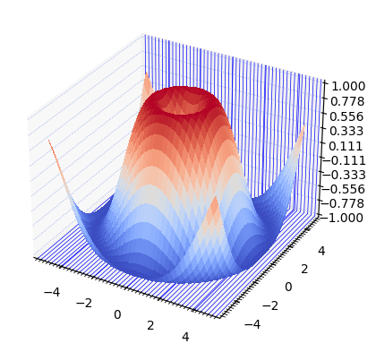

# [Issue #13919 - Impossible to configure minor/major grid line style independently in rcParams](https://github.com/matplotlib/matplotlib/issues/13919)

# **Contributors**

- Lander Joshua Vitug (Unit testing, User Guide)

- Yesom Son (Unit testing, implementation in mplot3d, documentation)

- Chenbo Wang (implementation in the main library, Acceptance Tests, documentation)
 <br /><br />

# **Table of Contents**

- Brief Description of the Issue
- Research and Observations
- Design and Implementations
 - implementation in the main library
 - implementation in mplot3d
- User Guide
- Testing
 - Unit Tests
 - Acceptance Tests

<br>

# **Brief Description of the Issue**

The issue highlights:

- It is impossible to configure a minor and a major grid line style independently using `rcParams`. A user is only able to change the whole grid line style with `rcParams`, not able to customize further. A user should configure them programmatically on their own; setting different styles for major and minor gridlines needs to be done manually for each plot, causing the user to do repetitive input, which is not ideal.

<br />

# **Research and Observations**

`matplotlib.rcParams` is a dictionary-like variable in Matplotlib that stores parameters for various aspects of Matplotlib's appearance, style, and behavior, such as font sizes, line widths, and color maps. `rcParams` stores all runtime configuration settings and it is global to the matplotlib package. A user can modify `rcParams` directly to customize the default appearance and behavior of their plots to create plots with their desired styles, fonts, colors, and other aesthetic features by dynamically changing the values of `rcParams` in a Python script or the python shell.

Using `rcParams` can save a lot of time and effort, especially when creating multiple plots with consistent styles. Instead of manually setting the same properties for each plot, you can modify the `rcParams` once and have those changes apply to all subsequent plots. Additionally, modifying `rcParams` can help ensure consistency across different plots created by different scripts and by different users in a collaborative project.

<br>

There are various ways to set configurations, and Matplotlib suggests 3 ways to customize plots:

1. Setting rcParams at runtime
2. Using style sheets
3. Changing a user's matplotlibrc file

Even though Matplotlib recommends setting `rcParams` at runtime over style sheets and matplotlibrc files ([Matplotlib documentation for more details](https://matplotlib.org/stable/tutorials/introductory/customizing.html)), it is noteworthy to address _matplotlibrc_ file because the file is involved in our implementation.

The _matplotlibrc_ file contains the default configuration settings for matplotlib and supports all `rcParams` parameters. A user can modify this file to change the settings and apply them to all their plots. However, it requires a user to locate the file in their matplotlib installation directory and open the file in a text editor and modify the settings. Or, one can create a new file called _matplotlibrc_ file in their current working directory and add settings. This requires extra work for users to set up. Also, changing the _matplotlibrc_ file affects the behavior of all matplotlib plots in the user's environment, so it is not quite ideal for users to modify the file.

More importantly, a user cannot change a minor grid and a major grid individually using `rcParams` as Matplotlib does not support the parameters, so it will not fix the issue.

<br />

# **Design and Implementation**

From the perspective of usability and functionality, the current design -- Matplotlib not supporting independency of grid line configurations -- is not ideal as it requires a user to know how `rcParam` works and extra works to achieve desired outputs. Our goal of the design is to not have users worry about the details of the implementation of `rcParams` and allow configuring styles and behaviors for minor grid lines and major grid lines independently, which increases usability.

<br />

Here are examples. Users can only change the whole gridline setting. It is not possible to distinguish major and minor gridlines.

```Python
# Creating a figure and a 3D axis
plt.rcParams['grid.linewidth'] = '0.5'
plt.rcParams['grid.color'] = '#80CAFF'

fig = plt.figure()
ax = fig.add_subplot(projection="3d")

# Creating a meshgrid
X = np.arange(-5, 5, 0.25)
Y = np.arange(-5, 5, 0.25)
X, Y = np.meshgrid(X, Y)
R = np.sqrt(X**2 + Y**2)
Z = np.sin(R)

# Plotting a 3D surface plot
surf = ax.plot_surface(X, Y, Z, cmap=cm.coolwarm, linewidth=0, antialiased=False)
ax.zaxis.set_major_locator(LinearLocator(10))
ax.xaxis.set_minor_locator(LinearLocator(50))
ax.yaxis.set_minor_locator(LinearLocator(50))

# Customizing each axis
# Similarly, further configurations are not possible
ax.zaxis._axinfo['grid']['color'] = '#738FE5'
ax.xaxis._axinfo['grid']['color'] = '#0000FF'
ax.yaxis._axinfo['grid']['linewidth'] = 0
ax.zaxis._axinfo['grid']['linestyle'] = ':'
```

Here is the output:


With our implementation, however, a user can change styles of minor and major gridlines independently even for each x-axis, y-axis, and z-axis. Here is an example of customizations:

```python
mpl.rcParams['_internal.classic_mode'] = False
mpl.rcParams['grid.minor.linestyle'] = ':'
mpl.rcParams['grid.major.linestyle'] = '-'
mpl.rcParams['grid.minor.linewidth'] = '1'
mpl.rcParams['grid.major.linewidth'] = '2.5'
mpl.rcParams['grid.minor.color'] = '#FF6A00'
mpl.rcParams['grid.major.color'] = '#80CAFF'

ax.xaxis._axinfo['grid']['color']['major'] = '#0000FF'
ax.yaxis._axinfo['grid']['linewidth']['minor'] = 0
ax.zaxis._axinfo['grid']['linewidth']['minor'] = 0
ax.zaxis._axinfo['grid']['color']['major'] = '#738FE5'
ax.zaxis._axinfo['grid']['linestyle']['major'] = ':'
```

Users have options to choose styles for each minor and major gridlines for each axis.

Here is the output:


We can see that there is no minor gridline on Y-axis, while there are tiny minor gridlines on X-axis. Also, we can set different colors for minor and major gridlines.
<br />

## **Implementation In Main Library**

To implement, we have to investigate how to deal with `rcParams`.

A user can access rcParams and modify it as follows.

```Python
rcParams['font.family'] = 'serif'
rcParams['font.size'] = 12
```

For more details, Here are the parameters included in `rcParams`:

```Python
from matplotlib import rcParams
print(rcParams)

output:
RcParams({'_internal.classic_mode': False,
          'agg.path.chunksize': 0,
          'animation.bitrate': -1,
          'animation.codec': 'h264',
          ...
          'axes.grid': True,
          'axes.grid.axis': 'y',
          'axes.grid.which': 'major'
          ...
          'grid.alpha': 1.0,
          'grid.color': '#b0b0b0',
          'grid.linestyle': '-',
          'grid.linewidth': 0.8,
          ...
        })
```

The above includes all parameters Matplotlib supports for the grid.

The original `rcParams` for `grid` starts with `grid.*`, which sets the default value of variables for both major and minor `grid`. As we can see, there are no separate parameters for major and minor grid properties in `rcParams`, so it is impossible to set different styles for major and minor `grid`. To allow independent styles of major and minor `grid`, we need to do the following:

- Removed each `grid.*` `rcParams` and added `grid.major.*` and `grid.minor.*` `rcParams`. ([code snippet 1](https://github.com/sonnmi/d01w23-team-Visual-Learners/blob/506b3b3c19271d0e652dd6454c6b99f8dc390316/matplotlib-main/lib/matplotlib/mpl-data/matplotlibrc#L515-L526))

- Updated the verifier for `rcParams` in `rcsetup.py` to adapt the new `rcParams` for `grid`. ([code snippet 2](https://github.com/sonnmi/d01w23-team-Visual-Learners/blob/506b3b3c19271d0e652dd6454c6b99f8dc390316/matplotlib-main/lib/matplotlib/rcsetup.py#L1127-L1135))

- Update `Tick.__init__` to use the new `rcParams` to set different `color` `linestyle` `linewidth` `alpha` for major and minor `grid`. ([code snippet 3](https://github.com/sonnmi/d01w23-team-Visual-Learners/blob/506b3b3c19271d0e652dd6454c6b99f8dc390316/matplotlib-main/lib/matplotlib/axis.py#L140-L168))

- Update `mpl-data/stylelib/*` to use a new convention when setting the default style for a different interface.

- Update `pyplot.py` to use new convention when setting style for `xkcd`. ([code snippet 4](https://github.com/sonnmi/d01w23-team-Visual-Learners/blob/506b3b3c19271d0e652dd6454c6b99f8dc390316/matplotlib-main/lib/matplotlib/pyplot.py#L666-L685))

<br>

For `toolkit.axisartist` library, we choose to use `grid.major.*` to replace `grid.*` as for the two use cases:

- The first API was deprecated, we updated it to avoid an error. ([code snippet 5](https://github.com/sonnmi/d01w23-team-Visual-Learners/blob/506b3b3c19271d0e652dd6454c6b99f8dc390316/matplotlib-main/lib/mpl_toolkits/axisartist/axislines.py#L326-L347))

- The second is only used to initialize default values before clearing `grid`. ([code snippet 6](https://github.com/sonnmi/d01w23-team-Visual-Learners/blob/506b3b3c19271d0e652dd6454c6b99f8dc390316/matplotlib-main/lib/mpl_toolkits/axisartist/axislines.py#L473-L485))

<br/>
<br/>

## **Implementation In `toolkit.mplot3d` Library**

Unlike 2D plots, we cannot create a minor gridline using `Axis.grid(which='minor',..)`. What we can do is use `Axis.set_minor_locator` which takes an instance of a `matplotlib.ticker.Locator` subclass, such as `matplotlib.ticker.LinearLocator` and `matplotlib.ticker.MultipleLocator`, which is used to determine the positions of the minor ticks on the axis. Matplotlib can use locators for axis ticks and gridlines.
<br />

However, it is not possible to change minor and major gridlines separately. Note that it is a different problem from the previous implementation because we do not have `which` property in `Axis3D`; we do not know whether it is a minor gridline or a major gridline. Working with grid lines in 3D is tricky in Matplotlib and setting styles is impossible. A user can change the whole gridlines but not just minor locators.

<br />
Here are examples.

<br />

Therefore, we decided to implement a new functionality to allow flexibility to 3D axes gridlines. The implementation is as follows. Note that the implementation even allows setting different styles of both minor and major grid lines for each `xaxis`, `yaxis`, and `zaxis`, which provides further customization.

<br />

Here are the codes that were added. Note that `lib/mpl_toolkits/mplot3d/axis3d.py` is the only one modified.

To work with configurations in 3D Axis, we need to understand `Axis._axinfo`. It is a dictionary that contains information about the axis. It is used internally by Matplotlib to determine how to draw the axis and has several keys that provide information such as the locations, visibility, and formats of the ticks. To have independent minor gridlines and major gridlines, we need to update `Axis._axinfo`.

```Python
if mpl.rcParams['_internal.classic_mode']:
    self._axinfo.update({
        # Create major and minor gridline properties
        # Apply the same default values
        # It was originally
        # 'grid': {
        #     'color': (0.9, 0.9, 0.9, 1),
        #     'linewidth': 1.0,
        #     'linestyle': '-'
        # }
        'grid': {
            'color': {
                'major': (0.9, 0.9, 0.9, 1),
                'minor': (0.9, 0.9, 0.9, 1)
            },
            'linewidth': {
                'major': 1.0,
                'minor': 1.0
            },
            'linestyle': {
                'major': '-',
                'minor': '-'
            }
        },
    })
else: # This is where we would use customized styles for gridlines
  self._axinfo['tick'].update({
      ...
      # Create major and minor gridline properties
      # Apply the rcParams major and minor properties
      'grid': {
          'color': {
              'major': mpl.rcParams['grid.major.color'],
              'minor': mpl.rcParams['grid.minor.color'],
          },
          'linewidth': {
              'major': mpl.rcParams['grid.major.linewidth'],
              'minor': mpl.rcParams['grid.minor.linewidth'],
          },
          'linestyle': {
              'major': mpl.rcParams['grid.major.linestyle'],
              'minor': mpl.rcParams['grid.minor.linestyle'],
          }
      }
  })
```

`matplotlib.rcParams` is still used to customize gridlines for 3D axes. Note that customized styles to gridlines will be applied when `rcParams['_internal.classic_mode']` is False. Because `rcParams` must be global and applied to all plots, it is reasonable to have an equivalent value for 2D and 3D gridline properties.

The setup for major and minor gridlines is done. Here is the code that allows the customization of gridlines.

One thing to note is that this `draw` function is called by `axis3d.Axis` objects. The objects can be `xAxis`, `yAxis`, or `zAxis`, which are subclasses of `Axis`, and thus I do not need to worry about how to style depending on the type of `Axis` objects by the OOP design. It ensures low coupling and no dependency on subclasses.

```Python
def draw(self, renderer):
  info = self._axinfo
  ...

  # Observations: lines contain all gridlines including major and ones created by minor locators
  lines = np.stack([xyz0, xyz0, xyz0], axis=1)
  lines[:, 0, index - 2] = maxmin[index - 2]
  lines[:, 2, index - 1] = maxmin[index - 1]
  self.gridlines.set_segments(lines)
  gridinfo = info['grid']

  # Seperate major gridlines and minor gridlines from `lines`
  # `self.get_minor_locator().tick_values(0, len(lines) - 1)`
  # will calcuate the number of ticks possible in the range of an axis
  # Note that the length of lines is the upper bound as it is the maximum value of gridlines including both minor and major gridlines.
  n_minor_gridlines = len(self.get_minor_locator().tick_values(0, len(lines) - 1))
  n_major_gridlines = len(ticks)
  if n_major_gridlines > 0:
      n_major_gridlines = len(ticks) - n_minor_gridlines
  major_gridlines = []
  minor_gridlines = []
  colors = []
  linewidths = []
  linestyles = []
  j_cnt = 0
  iteration = len(lines) // n_major_gridlines
  # Collect a user's customization for each line in `lines` depending on whether it is a minor or a major grid line
  for i in range(len(lines)):
      if j_cnt == iteration:
          j_cnt = 0
          major_gridlines.append(lines[i])
          colors.append(gridinfo['color']['major'])
          linewidths.append(gridinfo['linewidth']['major'])
          linestyles.append(gridinfo['linestyle']['major'])
      else:
          j_cnt += 1
          minor_gridlines.append(lines[i])
          colors.append(gridinfo['color']['minor'])
          linewidths.append(gridinfo['linewidth']['minor'])
          linestyles.append(gridinfo['linestyle']['minor'])
  # Set the segments, `lines` to gridlines of theaxis object
  self.gridlines.set_segments(lines)

  # Set the customizations for the segments
  # Note that len(lines) will be equal to
  # len(colors), len(linestyles), len(linewidths)
  self.gridlines.set_color(colors)
  self.gridlines.set_linestyle(linestyles)
  self.gridlines.set_linewidth(linewidths)

  self.gridlines.do_3d_projection()
  self.gridlines.draw(renderer)
```

<br />
<br />
<br />

## **Diagrams and Design Changes**


- Our implementation adds more options and flexibility to the user while keeping the overall design of the codebase unchanged.

<br />

## **Files modified**

`matplotlib/axis.py`

`matplotlib/rcsetup.py`

`matplotlib/pyplot.py`

`matplotlib/mpl-data/matplotlibrc`

`matplotlib/mpl-data/stylelib/*`

`mpl_toolkits/axisartist/axislines.py`

`mpl_toolkits/mplot3d/axis3d.py`

<br />

# **Testing**


#### **Unit tests**

Unit tests can be found in ['lib/matplotlib/tests/test_axis.py unit tests 1'](https://github.com/sonnmi/d01w23-team-Visual-Learners/blob/506b3b3c19271d0e652dd6454c6b99f8dc390316/matplotlib-main/lib/matplotlib/tests/test_axes.py#L5340-L5384), ['lib/matplotlib/tests/test_axis.py unit tests 2'](https://github.com/sonnmi/d01w23-team-Visual-Learners/blob/506b3b3c19271d0e652dd6454c6b99f8dc390316/matplotlib-main/lib/matplotlib/tests/test_axes.py#L8516-L8736) and ['lib/mpl_toolkits/mplot3d/tests/test_axes3d.py unit tests 3'](https://github.com/sonnmi/d01w23-team-Visual-Learners/blob/506b3b3c19271d0e652dd6454c6b99f8dc390316/matplotlib-main/lib/mpl_toolkits/mplot3d/tests/test_axes3d.py#L2177-L2428)


<br />

## **Acceptance Tests**

_Scenario 1: User wants all the plots created to have major gridlines with a certain style_

1. A user navigates to the `matplotlibrc` file after installing matplotlib library.
2. A user locates `grid` related `rcParams` for a major `grid`. (`grid.major.color`, `grid.major.linestyle`, `grid.major.linewidth`, `grid.major.alpha`)
3. A user sets the value of `rcParams` to the desired value.
4. A user creates a plot setting the major `grid` and major `tick` visible.
5. A user displays the plot.
6. A user accepts if the major `grid` follows set attributes in `rcParams`.

<br>

_Scenario 2: User wants all the plots created to have minor gridlines with a certain style_

1. A user navigates to the `matplotlibrc` file after installing `matplotlib` library.
2. A user locates `grid` related `rcParams` for minor `grid`. (`grid.minor.color`, `grid.minor.linestyle`, `grid.minor.linewidth`, `grid.minor.alpha`)
3. A user sets the value of `rcParams` to the desired value.
4. A user creates a plot setting the minor `grid` and minor `tick` visible.
5. A user displays the plot.
6. A user accepts if the minor `grid` follows set attributes in `rcParams`.

<br>

_Scenario 3: User wants all the plots created to have major and minor gridlines with a certain style_

1. A user navigates to the `matplotlibrc` file after installing `matplotlib` library.
2. A user locates `grid` related `rcParams`.
3. A user sets the value of `rcParams` to the desired value.
4. A user creates a plot setting the both `grid` and both `tick` visible.
5. A user displays the plot.
6. A user accepts if both the major and minor `grid` follows set attributes in `rcParams`.

<br>

_Scenario 4: User wants most of the plots created to have major gridlines with a certain style but others to be set manually_

1. A user navigates to the `matplotlibrc` file after installing matplotlib library.
2. A user locates `grid` related `rcParams` for a major `grid`. (`grid.major.color`, `grid.major.linestyle`, `grid.major.linewidth`, `grid.major.alpha`)
3. A user sets the value of `rcParams` to the desired value for most of the plot.
4. A user creates a plot setting the major `grid` and major `tick` visible.
5. A user sets the attribute of the major `grid` for this plot manually.
6. A user displays the plot.
7. A user accepts if the major `grid` follows the manually set attributes.

<br>

_Scenario 5: User wants most of the plots created to have minor gridlines with a certain style but others to be set manually_

1. A user navigates to the `matplotlibrc` file after installing matplotlib library.
2. A user locates `grid` related `rcParams` for minor `grid`. (`grid.minor.color`, `grid.minor.linestyle`, `grid.minor.linewidth`, `grid.minor.alpha`)
3. A user sets the value of `rcParams` to the desired value for most of the plot.
4. A user creates a plot setting the minor `grid` and minor `tick` visible.
5. A user sets the attribute of the minor `grid` for this plot manually.
6. A user displays the plot.
7. A user accepts if the minor `grid` follows the manually set attributes.

<br>

_Scenario 6: User wants most of the plots created to have major and minor gridlines with a certain style but others to be set manually_

1. A user navigates to the `matplotlibrc` file after installing matplotlib library.
2. A user locates `grid` related `rcParams`.
3. A user sets the value of `rcParams` to the desired value for most of the plot.
4. A user creates a plot setting the both `grid` and both `tick` visible.
5. A user sets the attribute of both `grid` for this plot manually.
6. A user displays the plot.
7. A user accepts if both the major and minor `grid` follows the manually set attributes.

<br>

_Scenario 7: User wants all of the 3d plots created to have major and minor gridlines with a certain style_

1. A user navigates to the `matplotlibrc` file after installing `matplotlib` library.
2. A user locates `grid` related `rcParams`.
3. A user sets the value of `rcParams` to the desired value.
4. A user creates a 3d plot.
5. A user defines the major and minor `grid` they want to have in the 3d plot with `set_major_locator` and `set_minor_locator` functions.
6. A user displays the 3d plot.
7. A user accepts if both the major and minor `grid` follows set attributes in `rcParams`.
