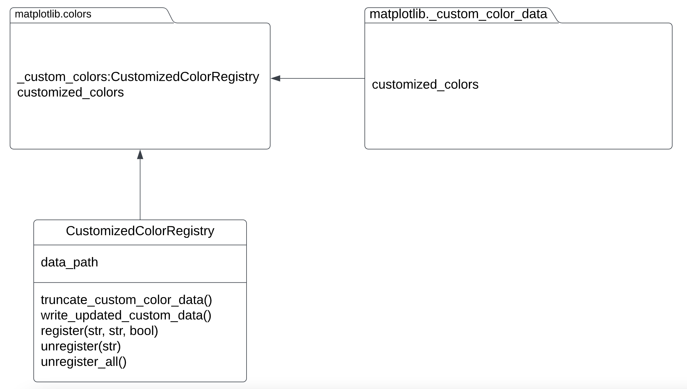

# [Issue 23967 - User-defined named colors](https://github.com/matplotlib/matplotlib/issues/23967)

Hongkang Yu (issue fix) | Yuehai Zhou (unit testing)
  

## **Implementation**

The implementation mainly lies within `color.py` file. To create the feature, we added a new class `CustomizedColorRegistry` for users to define their own named colors. Within the class we implemented three methods: `register`, `unregister`, `unregister_all` each allowing the user to add a customized color, delete a specific customized color and delete all customized colors.

Class Diagram:

#### How this implementation addressed the issue:

Issue #23967 can be split into 4 features:

1. As a user, I would like to customize the name of a color.
 Matplotlib stores a color_name:color_definition dictionary in `matplotlib.colors` module. When users pass the names of colors as a parameter to the functions in Matplotlib, the names are parsed to a definition by checking the dictionary `matplotlib.colors._colors_full_map`. Our implementation adds another dictionary, `customized_colors`, to store the customized color name-definition pairs. When users register a new color name-definition pair, the new key-value pair is added to `customized_colors`, and `matplotlib.colors._colors_full_map` calls update() with `customized_colors` as the parameter. Therefore, when users use the colors they registered directly by name, Matplotlib would be able to parse them.

2. As a user, I would like to unregister the names of the color I registered.
 For unregistering, our implementation pops the customized color name passed in from `matplotlib.colors._colors_full_map` and `matplotlib.colors.customized_colors`. So Matplotlib can no longer parse this name. The method of unregistering all customized colors is provided as well, which pops all the keys of `matplotlib.colors.customized_colors` from `matplotlib.colors._colors_full_map` and then clear `matplotlib.colors.customized_colors`.

3. As a user, I would like to check all the customized names of the color I registered.
 Our implementation provides a method just like the method of checking all the built-in color name-definition pairs. Our method `matplotlib.colors.get_custom_colors_mapping()` returns `matplotlib.colors.customized_colors` which keeps track of user-defined named colors.

4. As a user, I would like to persist the names of the color I registered.
 The built-in color name-definition pairs are persisted in `matplotlib._color_data`. Our implementation adds a new module `matplotlib._custom_color_data` to persist customized color name-definition data. After `register`, `unregister`, and `unregister_all`, `matplotlib._custom_color_data` is rewritten with the updated `matplotlib.colors.customized_colors`.

#### The changes that were made to the design/codebase of the chosen system:

We did not make any changes to the design of the chosen system, as we only added changes to the original code in the `color.py` file. There is nothing that changed with the architect.

#### Related Files:

Modified:

- `matplotlib-main/lib/matplotlib/colors.py` ([line 95 to line 202](https://github.com/sonnmi/d01w23-team-Visual-Learners/blob/506b3b3c19271d0e652dd6454c6b99f8dc390316/matplotlib-main/lib/matplotlib/colors.py#L95-L202))

- `matplotlib-main/lib/matplotlib/pyplot.py` ([line 73](https://github.com/sonnmi/d01w23-team-Visual-Learners/blob/506b3b3c19271d0e652dd6454c6b99f8dc390316/matplotlib-main/lib/matplotlib/pyplot.py#L73))

- `matplotlib-main/lib/matplotlib/tests/test_colors.py` (See "Unit tests" section below)

Added:

- `matplotlib-main/lib/matplotlib/_custom_color_data.py` ([link](https://github.com/sonnmi/d01w23-team-Visual-Learners/blob/506b3b3c19271d0e652dd6454c6b99f8dc390316/matplotlib-main/lib/matplotlib/_custom_color_data.py))

 

## **Testing**

#### **Unit tests**

Unit tests can be found in (`matplotlib-main/lib/matplotlib/tests/test_colors.py`, [line 1601 to line 1675](https://github.com/sonnmi/d01w23-team-Visual-Learners/blob/506b3b3c19271d0e652dd6454c6b99f8dc390316/matplotlib-main/lib/matplotlib/tests/test_colors.py#L1601-L1675))

 

#### **Acceptance Tests**:

_Scenario 1: User wants to add a customized color_

1. User imports `matplotlib.pyplot` as `plt`.
2. User adds customized color using `plt.custom_colors.register(cust_name, color_code)`.
3. User access the registered color using `cust_name`.

_Scenario 2: User wants to delete a customized color_

1. User imports `matplotlib.pyplot` as `plt`.
2. User deletes customized color using `plt.custom_colors.unregister(cust_name, color_code)`.
3. Customized color `cust_name` is deleted.

_Scenario 3: User wants to change the color code of a registered customized color_

1. User imports `matplotlib.pyplot` as `plt`.
2. User overrides customized color using `plt.custom_colors.register(cust_name, new_color_code, override=True)`.
3. User access the updated color using `cust_name`.

_Scenario 4: User wants to delete all customized colors they defined previously_

1. User imports `matplotlib.pyplot` as `plt`.
2. User deletes all customized colors using `plt.custom_colors.unregister_all()`.
3. All customized colors are now deleted.
