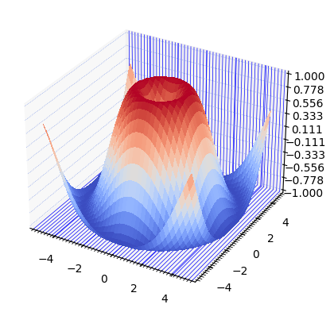
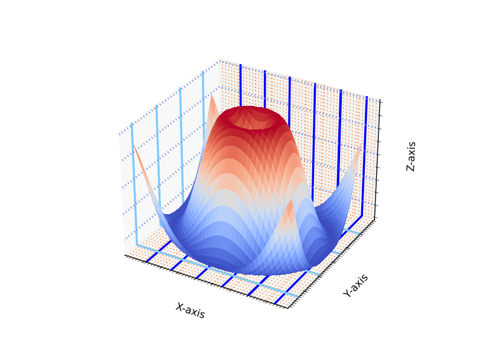

<br />

Here are examples. Users can only change the whole gridline setting. It is not possible to distinguish major and minor gridlines.

```Python
# Creating a figure and a 3D axis
plt.rcParams['grid.linewidth'] = '0.5'
plt.rcParams['grid.color'] = '#80CAFF'

fig = plt.figure()
ax = fig.add_subplot(projection="3d")

# Creating a meshgrid
X = np.arange(-5, 5, 0.25)
Y = np.arange(-5, 5, 0.25)
X, Y = np.meshgrid(X, Y)
R = np.sqrt(X**2 + Y**2)
Z = np.sin(R)

# Plotting a 3D surface plot
surf = ax.plot_surface(X, Y, Z, cmap=cm.coolwarm, linewidth=0, antialiased=False)
ax.zaxis.set_major_locator(LinearLocator(10))
ax.xaxis.set_minor_locator(LinearLocator(50))
ax.yaxis.set_minor_locator(LinearLocator(50))

# Customizing each axis
# Similarly, further configurations are not possible
ax.zaxis._axinfo['grid']['color'] = '#738FE5'
ax.xaxis._axinfo['grid']['color'] = '#0000FF'
ax.yaxis._axinfo['grid']['linewidth'] = 0
ax.zaxis._axinfo['grid']['linestyle'] = ':'
```

Here is the output:


With our implementation, however, a user can change styles of minor and major gridlines independently even for each x-axis, y-axis, and z-axis. Here is an example of customizations:

```Python
mpl.rcParams['_internal.classic_mode'] = False
    mpl.rcParams['grid.minor.linestyle'] = ':'
    mpl.rcParams['grid.major.linestyle'] = '-'
    mpl.rcParams['grid.minor.linewidth'] = '1'
    mpl.rcParams['grid.major.linewidth'] = '2.5'
    mpl.rcParams['grid.minor.color'] = '#FF6A00'
    mpl.rcParams['grid.major.color'] = '#80CAFF'

ax.xaxis._axinfo['grid']['color']['major'] = '#0000FF'
  ax.yaxis._axinfo['grid']['linewidth']['minor'] = 0
  ax.zaxis._axinfo['grid']['linewidth']['minor'] = 0
  ax.zaxis._axinfo['grid']['color']['major'] = '#738FE5'
  ax.zaxis._axinfo['grid']['linestyle']['major'] = ':'
```

Users have options to choose styles for each minor and major gridlines for each axis.

Here is the output:


We can see that there is no minor gridline on Y-axis, while there are tiny minor gridlines on X-axis. Also, we can set different colors for minor and major gridlines.
<br />
