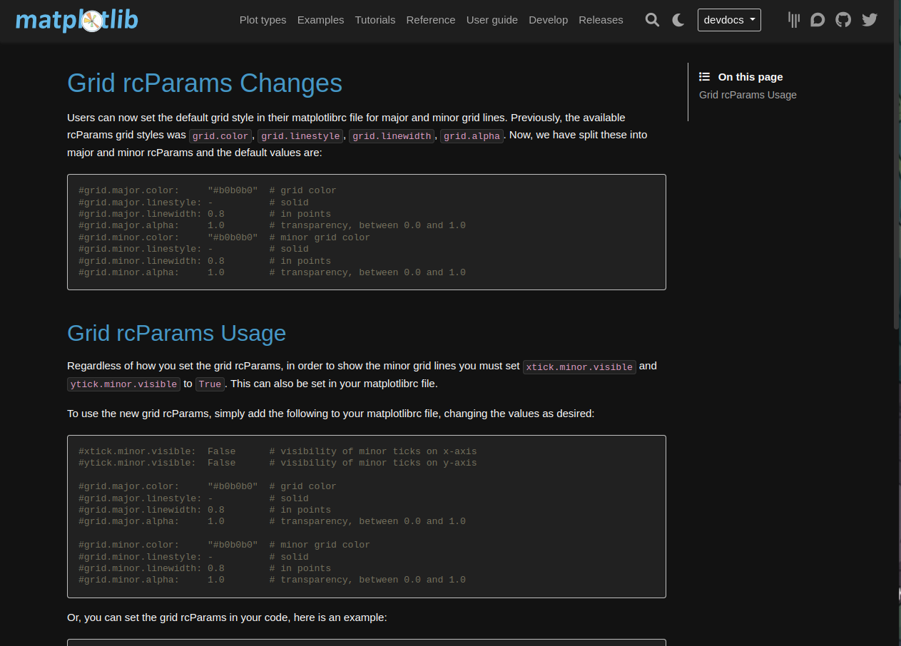
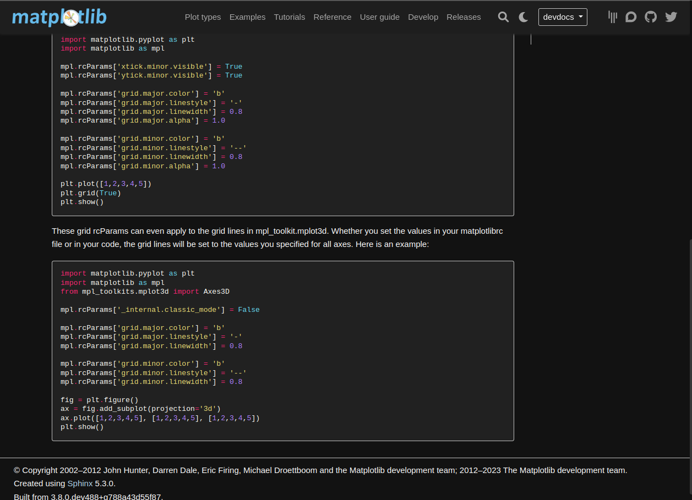

# User Guide #13919

## Grid rcParams Changes

Users can now set the default grid style in their matplotlibrc file for major and minor grid lines. Previously, the available rcParams grid styles was ``grid.color``, ``grid.linestyle``, ``grid.linewidth``, ``grid.alpha``. Now, we have split these into major and minor rcParams and the default values are:

```python
  #grid.major.color:     "#b0b0b0"  # grid color
  #grid.major.linestyle: -          # solid
  #grid.major.linewidth: 0.8        # in points
  #grid.major.alpha:     1.0        # transparency, between 0.0 and 1.0
  #grid.minor.color:     "#b0b0b0"  # minor grid color
  #grid.minor.linestyle: -          # solid
  #grid.minor.linewidth: 0.8        # in points
  #grid.minor.alpha:     1.0        # transparency, between 0.0 and 1.0
```

## Grid rcParams Usage

Regardless of how you set the grid rcParams, in order to show the minor grid lines you must set ``xtick.minor.visible`` and ``ytick.minor.visible`` to ``True``.
This can also be set in your matplotlibrc file.

To use the new grid rcParams, simply add the following to your matplotlibrc file, changing the values as desired:

```python
  #xtick.minor.visible:  False      # visibility of minor ticks on x-axis
  #ytick.minor.visible:  False      # visibility of minor ticks on y-axis
  
  #grid.major.color:     "#b0b0b0"  # grid color
  #grid.major.linestyle: -          # solid
  #grid.major.linewidth: 0.8        # in points
  #grid.major.alpha:     1.0        # transparency, between 0.0 and 1.0

  #grid.minor.color:     "#b0b0b0"  # minor grid color
  #grid.minor.linestyle: -          # solid
  #grid.minor.linewidth: 0.8        # in points
  #grid.minor.alpha:     1.0        # transparency, between 0.0 and 1.0
```

Or, you can set the grid rcParams in your code, here is an example:

```python
  import matplotlib.pyplot as plt
  import matplotlib as mpl

  mpl.rcParams['xtick.minor.visible'] = True
  mpl.rcParams['ytick.minor.visible'] = True

  mpl.rcParams['grid.major.color'] = 'b'
  mpl.rcParams['grid.major.linestyle'] = '-'
  mpl.rcParams['grid.major.linewidth'] = 0.8
  mpl.rcParams['grid.major.alpha'] = 1.0

  mpl.rcParams['grid.minor.color'] = 'b'
  mpl.rcParams['grid.minor.linestyle'] = '--'
  mpl.rcParams['grid.minor.linewidth'] = 0.8
  mpl.rcParams['grid.minor.alpha'] = 1.0

  plt.plot([1,2,3,4,5])
  plt.grid(True)
  plt.show()
```

These grid rcParams can even apply to the grid lines in mpl_toolkit.mplot3d. Whether you set the values in your matplotlibrc file or in your code, the grid lines will be set to the values you specified for all axes. Here is an example:

```python
  import matplotlib.pyplot as plt
  import matplotlib as mpl
  from mpl_toolkits.mplot3d import Axes3D

  mpl.rcParams['_internal.classic_mode'] = False

  mpl.rcParams['grid.major.color'] = 'b'
  mpl.rcParams['grid.major.linestyle'] = '-'
  mpl.rcParams['grid.major.linewidth'] = 0.8

  mpl.rcParams['grid.minor.color'] = 'b'
  mpl.rcParams['grid.minor.linestyle'] = '--'
  mpl.rcParams['grid.minor.linewidth'] = 0.8

  fig = plt.figure()
  ax = fig.add_subplot(projection='3d')
  ax.plot([1,2,3,4,5], [1,2,3,4,5], [1,2,3,4,5])
  plt.show()
```

## User Guide in the style of Matplotlib

